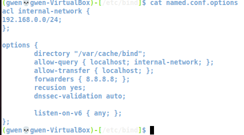
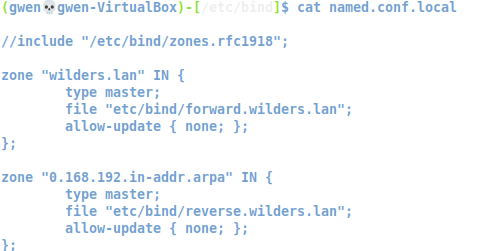
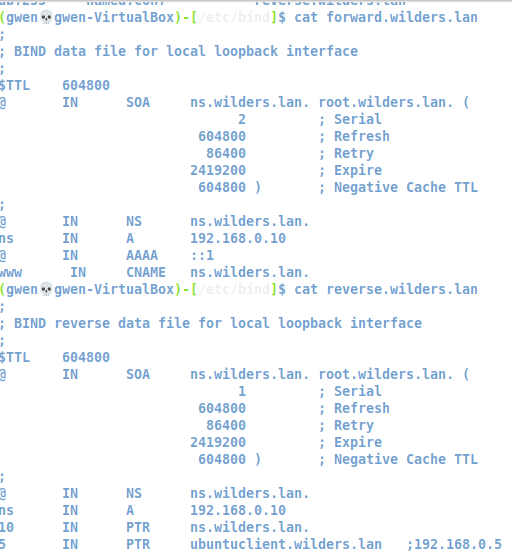
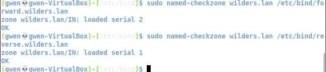
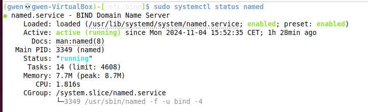
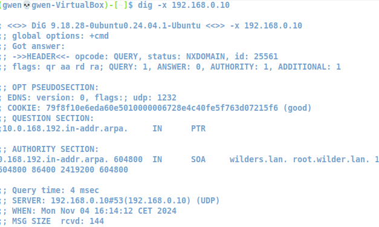
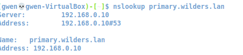

# Configuration d'un serveur DNS linux 

Installer les paquets bind9  
`sudo apt install bind9 bind9utils bind9-doc -y`  

Configurer le fichier de configuration de named :  
`sudo nano /etc/bind/named.conf.options`  

  

Configurer le fichier de définition des zones :  
`sudo nano /etc/bind/named.conf.local`  

  

Créer es fichiers de zone forward et reverse, puis les configurer :   
`sudo nano /etc/bind/forward.wilders.lan`  
`sudo nano /etc/bind/reverse.wilders.lan`  

  

Vérifier si il n'y a pas de retour d'erreur sur bind9 :  
`sudo named-checkconf`  

  

Vérifier les fichiers forward et reverse:  
`sudo named-checkzone wilders.lan /etc/bind/forward.wilders.lan`  
`sudo named-checkzone wilders.lan /etc/bind/reverse.wilders.lan`  

  

Redémarrer bind et vérifier que le service fonctionne :  
`sudo systemctl restart bind9`  
`sudo systemctl status bind9`  

  

Test sur le client :  

nslookup  
  

dig  
  

